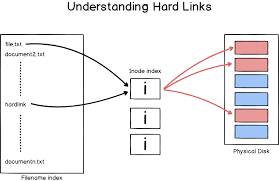

# Basic notes
### Wildcards
Wildcards|meaning
-|-
*|Matches any characters
?|Matches any single characters
[<i>characters</i>]| Match any character that is a member of the set <i>characters</i>
[<i>!characters</i>]| Match any character that is a not member of the set <i>characters</i>
[[class]]|Match any character that is a member of the specified class 

Class|Meaning
-|-
[:alnum]|Matches any alphanumeric character
[:alpha]|Matches any alphabetic character
[:digit]|Matches any numeral
[:lower]|Matches any lowercase letter
[:upper]|Matches any uppercase letter

## Linux file notes

Directory|Purpose
-|-
/|root directory
/bin|Contains binaries(programs) that must be present for system startup
/boot|Contains linux kernel. initializes RAM disk image and boot loader
/dev|Special directory that contain device nodes. "Everything is a file in linux. Here is where the kernel maintains a list of all the devices it understands
/etc|This directory contains all the system-wide configuration files. 
/home|Each user is given a directory in /home. It is like the user folder in windows
/lib| Contains shared library files used by the core system programs.like DLLs in windows
/lost + found|It is used in the case of a partial recovery from a file system corruption event. Unless something bad happens this folder will remain empty
/media|On modern linux systems, this directory will contain the mount points for removable media such as USB drives. 
/mnt|On older linux systems this directory contains the mount points for devices that have been mounted manually.
/opt|Used to install "optional" software. Mainly used to hold commercial software products
/proc|This directory is special. It's not a real file system in the sense of files stored on your hard drive. It's a virtual file system maintained by the kernel. The files contain peepholes into the kernel itself
/root|Home directory for the root user
/sbin|System Binaries. Needed for the system to run. Accessed only by a super user.
/tmp|used for temp storage of devices
/usr|It contains all program and support files used by a regular user.
/var|This directory is used often and hold data about the system.
/var/log| This is where system logs are stored.

## Basic linux commands
Command|Name|Description|Extra vars
-|-|-|-
pwd|Present working directory|Shows the directory that you are currently in
cd {path name}|Change directory| change to a different directory
ls {path name or argument}| List directory contents|
less|opposite of more| allows you to scroll up and down in a test file (useful)
mv|
cp|
mkdir||| -p (adds recursive directories)
ln|
rm|||-r (means recursive), -f (means force), -rf (recursive and force)

## Tech support commands
Command|Name|Description|Extra vars
-|-|-|-

## link types

Symbolic links
- This is really like a shortcut on windows
- It is a pointer to the file
- If you delete the original file, the symbolic link will become useless
- This is the more modern way of creating links
- Different iNode numbers
Hard links
- A different name for the same file
- same file size
- Same iNode numbers
- Deleting the original file, will still allow hard links to be operational
Here is a picture of the two links  
